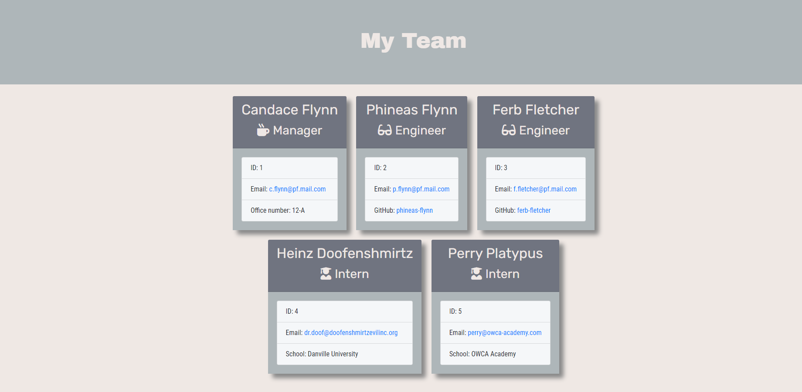

# Template Engine - Employee Summary

## Description
The Template Engine - Employee Summary application helps users/managers to create a html file that display their team members' information. The user is asked a series of questions about themselves and their team members and the generated html file will contain the team's information. The project is written in Javascript ES6 and the application is executed on Node.js.

Link to the Github repository: https://github.com/akwanmtl/Template-Engine-Employee-Summary

## Table of Contents

* [Installation](#installation)
* [Usage](#usage)
* [Tests](#tests)
* [Credits](#credits)
* [License](#license)

## Installation

Node.js is required to run the application. Also, the application uses the [Inquirer package](https://www.npmjs.com/package/inquirer). To first get started, you will need to install the dependencies by running:
```
npm install
```
## Usage 

To run the application, use the following command:
```
node app.js
```
You are then asked for the following information about your team:
1. Your name, ID number, email address and office number
2. The engineer's or engineers' name, email address and github username
3. The intern or interns' name, email address and school name

There validation put into place to check whether the inputs are valid. Specifically:
* The ID must be unique in the team and is a positive integer
* The office number is either composed of digits, digits followed by a alphabet character, or digits and a single alphanumeric character separated by a hyphen (e.g. 123, 12A, 12-B are accepted formats)
* The email address follows the standard format of accoutname@maildomain.com as described by [xMatters](https://help.xmatters.com/ondemand/trial/valid_email_format.htm)
* The github username must consists of alphanumeric characters or single hyphens, and cannot begin or end with a hyphen, and must a maximum of 39 characters.

You enter/choose your answers in the command line. After you finish to answer the questions, the team.html file is generated in the ./output folder. A style.css file is also copied to the ./output folder to change the styling of the html file.

Click on the GIF to see a narrated version of the demo.
[](https://drive.google.com/file/d/1MS3qd3aNJOyerivx-2HeB6fEwAP4tNIB/view?usp=sharing) 

Here is a screenshot of the html file loaded in a browse:


## Tests

The application was created using a test-driven development methodology. The classes were first built and tested before adding the user interface component of the application. The tests can be run with the command
```
npm run test
```

## Credits

* [Inquirer package](https://www.npmjs.com/package/inquirer)
* [License badge link](https://gist.github.com/lukas-h/2a5d00690736b4c3a7ba)

## License

[](https://opensource.org/licenses/MIT)

Copyright (c) [2020] [Annie Kwan]
